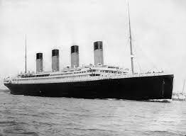

# Titanic Survival Passengers Prediction

  

RMS Titanic was a British passenger liner, operated by the White Star Line, wich sank in the North Atlantic Ocean on 15 April 1912 after striking an iceberg during her maiden  voyage from Southampton to New York City.

Of the estimated 2224 passengers and crew aboard, more 1500 died and 705 survived..

In this notebook, we will analyze the dataset and make a prediction model to see wich passengers  on board the ship would survive.

## Dataset Columns

- pssengerid 
- survived - 0 if the passenger not survived, 1 if survived
- pclass - passenger class, 1: 1st clas, 2: 2nd class and 3: 3rd class
- name- passenger name
- sex - passenger sex; 1: male, 0:female
- age - passenger age
- sibsp - number of siblings/spouses aboard
- parch - number of perants/children aboard
- ticket - number of ticket
- fare - passenger fare
- cabin 
- embarked - port of embarkation, (C: Cherbourg, Q: Queenstown, S: Southampton)